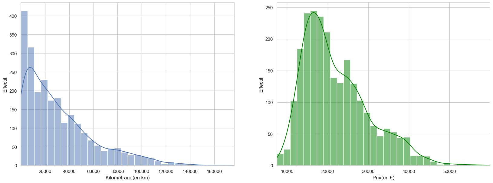
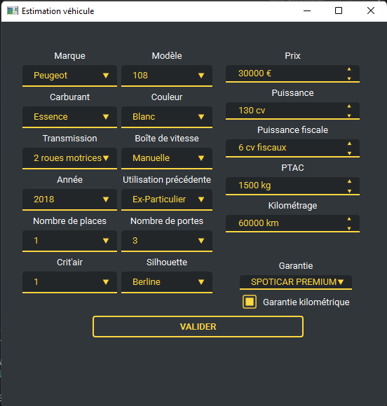

# Projet Machine Learning

L'objectif de ce projet est de créer un modèle basé sur des techniques de machine learning pour prédire le prix d'un véhicule choisi par l'utilisateur à partir de ces caractéristiques. Le modèle étant entraîné sur une bases de données.

Le programme est divisé en deux grandes parties :

- Scraping
- Estimation

---
## Scraping

### **Données**

Le site d'origine des données est le site [Spoticar](https://www.spoticar.fr). 

Elles concernent quatre marques sur lesquelles le site est spécialisé :

- Peugeot
- Citroën
- Opel
- Fiat

Pour chaque marque, nous pouvons récupérer 600 données (soit un total de 2400) de par la construction du site qui nous impose cette contrainte.

Chaque véhicule est ainsi codé sous la forme d'une classe `Voiture` comprennant les éléments suivants :

| Variable   |      Type      | Description    |
|:-|:-|:-|
| `marque` |Catégorielle| Marque du véhicule| 
| `modele` |Catégorielle| Nom du modèle de véhicule| 
| `carburant` |Catégorielle| Type de carburant ou d'alimentation | 
| `prix` |Numérique| Prix du véhicule sur le site|
| `kilometrage` |Numérique| Kilométrage du véhicule |
| `garantie_kilometrage` |Dichotomique| Indicateur de fiabilité concernant la valeur du kilométrage |
| `boite_de_vitesse` |Catégorielle| Type de boîte de vitesse |
| `transmission` |Numérique| Nombre de roues motrices | 
| `couleur` |Catégorielle| Couleur du véhicule | 
|  `garantie` |Dichotomique| Type de garantie proposé par le site vendeur | 
| `date_mise_circulation` |Numérique| Année de mise en  circulation du véhicule| 
| `puissance` |Numérique| Puissance du moteur(en cv) |
| `silhouette` |Catégorielle| Type de véhicule | 
| `nb_places` |Numérique| Nombre de places | 
| `utilisation_pred` |Catégorielle| Précédente utilisation/propriétaire du véhicule | 
| `puissance_fiscale` |Numérique| Puissance fiscale du véhicule (en cv) |
| `critait` |Numérique| Indice Crit'air du véhicule | 
| `ptac` |Numérique| PTAC du véhicule | 
| `nb_portes` |Numérique| Nombre de portes |
---
### **Récupération des données**

Le scraping fonctionne à l'aide du module `selenium` et du navigateur Chrome de Google (ainsi que son driver). 

La fonction de scraping s'occupe d'ouvrir la page web, de gérer les cookies et d'ouvrir chaque annonce pour en récupérer les données. Cette fonction s'itère pour chaque marque permettant de réinitiliser le driver  à chaque fois et d'éviter une surcharge de ce dernier. 

Les temps d'attente ont été minimisés, mais certains restent à l'aide de la fonction `sleep()` pour gérer les différents débit de connexion. 

Chaque page de véhicule est stockée dans la classe `Voiture` précédemment évoquée et ajouté à une liste. 

Lorsque les 600 annonces ont été scrapé, la fonction stocke cette liste dans un fichier `json` au nom de la marque permettant la séréalisation de celui-ci.

---
### **Aperçu des données**




Les deux graphiques permettent de rendre compte de la répartition des prix et du kilométrage dans la base de données compris avec ce projet.

On y observe des prix centré autour de 20 000 € et des kilométrages décroissant mais plus présent dans des valeurs inférieurs à 40 000 km. Cela s'explique par le type de véhicule vendus par Spoticar.

*NB : les graphiques peuvent changer si le scraping est relancé.*

---
### **Traitement des données**

Avant tout calcul de modèle, les données doivent subir un traitement permettant leur compatibilité avec le module `scikit-learn`. 

Il faut premièrement unifier les données obtenues. Elles sont divisés en quatre fichiers `json` donc le nom est éponyme aux marques. Pour cela, on les ouvre et les concatène à l'aide de la fonction `concat` de `pandas` sous la forme d'un tableau de données (dataframe).
 
La seconde étape est la gestion des données manquantes pour lesquelles s'offrent plusieurs solutions :

- Suppression des observations
    - Le suppression d'observation réduit la taille de la base de données, chose que nous ne pouvons nous permettre de par le faible nombre d'observations. Cela les réduirait d'environ 1/3 et pourrait rendre le modèle faux.
- Suppression de variables
    - Presque toutes les variables sont concernées par ce problème, cette solution n'est donc pas viable.
- Imputation
    - **C'est la solution que nous avons choisie telle que :**
        - Les variables numériques sont imputées par la moyenne.
        - les variables catégorielles et dichotomiques sont imputées par la valeur la plus présente.

Une fois que toutes les données manquantes ont été imputées, il faut transformer les variables catégorielles en variables dichotomiques pour la compatibilité avec les modèles. Pour cela, on utilise la fonction `get_dummies()` de `pandas`.

Elle transforme une variable catégorielle en autant de variables dichotomiques qu'il y a de modalités et fais prendre les valeurs 0 et 1 à ces dernières. On se retrouve alors avec un tableau de données comprennant une soixantaine de colonnes.

Enfin, il suffit de transformer ce dataframe final en deux tableau du module `numpy` : 
- L'un contenant les valeurs pour chaque variables.
- L'autre contenant les prix.

Ces deux tableaux finaux sont ceux que l'on utilisera pour calculer les modèles.

---

## Estimation
### **Modèle utilisés**

Les modèles utilisés sont tous tirés du module `scikit-learn`.

Ils comprennent :

- Elastic Net
- Support Vector Machine
- Random Forest
- Multi-Layer Perceptron
- KNN

Les données sont divisés en deux splits avec un rapport 2/3 ; 1/3  :

1. Entraînement
2. Test

Chaque modèle est entrainé par validation croisée sur le split d'entraînement permettant d'obtenir les paramètres optimaux parmi une liste préselectionnée.

Une fonction permet ensuite de calculer le meilleur estimateur, de vérifier que celui-ci ne fait pas de sur-apprentissage à l'aide des données test et de le sauvegarder dans un fichier au format `pickle`.

*NB : le meilleur modèle est recalculé si le scraping est relancé.*

Concernant l'estimation du prix du véhicule de l'utilisateur, cette partie sera traitée dans la partie interface.

---

## Interface utilisateur

Ce projet est composé de deux interfaces différentes. La première offrant le choix à l'utilisateur de lancer le scraping ou d'estimer son véhicule. La seconde découlant de la première permet à l'utilisateur de donner les paramètres de son véhicule.

### **Interface textuelle**

L'interface textuelle a été codée à l'aide du module `typer`. 

Pour lancer l'interface, il suffit d'exécuter la commande suivante :

```sh
py -m veron_nepveux_project main.py --help
```

Cette commande permet d'afficher les deux commandes disponibles.

Il est ensuite possible de lancer le scraping :

```sh
py -m veron_nepveux_project scraping
```

*NB : l'exécution du scrapping dure au moins 8h*

ou l'estimation :

```sh
py -m veron_nepveux_project estimation
```

Lancer la commande d'estimation abouti à cette interface : 



Lorsque l'utilisateur valide, le modèle précédemment choisi estime le prix prédit de la voiture et le retourne ainsi que le prix d'origine en fournissant la différence de prix entre les deux dans la commande.

---
## Installation

Pour installer le module, il y a deux manières :

- Depuis GitHub :
```sh
py -m pip install git+https://github.com/mathver/VERON_NEPVEUX_PROJECT
```

- En téléchargeant le dossier :
```sh
py -m pip install C:/Users/Downloads/VERON_NEPVEUX_PROJECT
```

Suite à l'une des ces deux commandes, vous devriez être apte à exécuter les commandes précédemment évoquées.